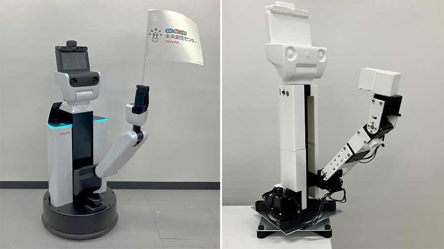

# THSR: Teleoperation Hardware for HSR

This repository publishes 3D data and documentation for a leader-side teleoperation hardware named THSR to be used with the Toyota Human Support Robot (HSR).

## Quick links

- Assembly model: [STEP/THSR-Total-000-A.STEP](STEP/THSR-Total-000-A.STEP)
- Printable parts (examples; see full sets under `STL/THSR-Arm`, `STL/THSR-Lift`, `STL/THSR-Turn`):
  - Arm: [STL/THSR-Arm/THSR-Arm-010.STL](STL/THSR-Arm/THSR-Arm-010.STL), etc.
  - Lift: [STL/THSR-Lift/THSR-Lift-010.STL](STL/THSR-Lift/THSR-Lift-010.STL), etc.
  - Turn: [STL/THSR-Turn/THSR-Turn-010.STL](STL/THSR-Turn/THSR-Turn-010.STL), etc.
- Assembly guide: [docs/THSR-組付手順書.pdf](docs/THSR-組付手順書.pdf)
- Bill of Materials (BOM): [docs/THSR-BOM.csv](docs/THSR-BOM.csv)
